<h1 align="center">Hey  I'm Termux</h1>
<h3 align="center">Software Engineer</h3>

  

## 📌 About Me
- 💻 Dev **Go / Python** • 🧠 **AI & Automação**
- 🔎 Curioso sobre **bugs, vulnerabilidades e sistemas**
- 🧩 Autista nível 2 • **10+ anos explorando hacking & segurança**

## 🧠 My Focus Areas
- ⚙️ **Stack:** Go  • AI • Tools

## 📊 GitHub Stats & Trophies

  
  

  

  

  

## 🛠️ Languages & Tools

> ## Programming Languages

   

> ## Frontend

       

  

## 🔗 Connect with Me

  

## 💬 Quote
> Online: > pkg install astflye

  

  

